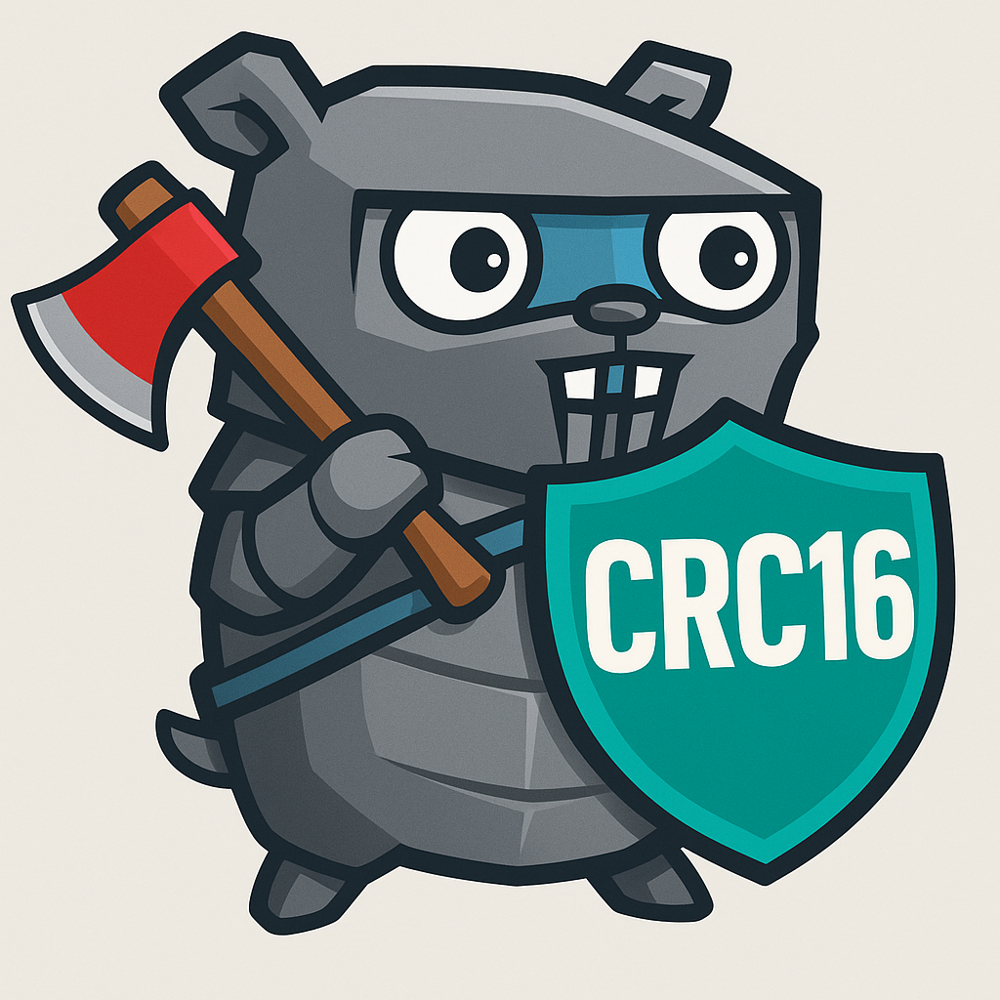

# CRC-16



Modern rewrite of [crc16](https://github.com/r10r/crc16)

## Requirements

- Golang 1.24.1 or higher
  - [Download](https://go.dev/dl/)

## Usage

```go
package main

import (
	"fmt"

	"github.com/r10r/crc16"
)

func main() {
	table := crc16.MakeTable(crc16.MAXIM)

	crc := crc16.Checksum([]byte("Hello world!"), table)
	fmt.Printf("CRC-16 MAXIM: %X\n", crc)

	// using the standard library hash.Hash interface
	h := crc16.New(table)
	h.Write([]byte("Hello world!"))
	fmt.Printf("CRC-16 MAXIM: %X\n", h.Sum16())
}
```
